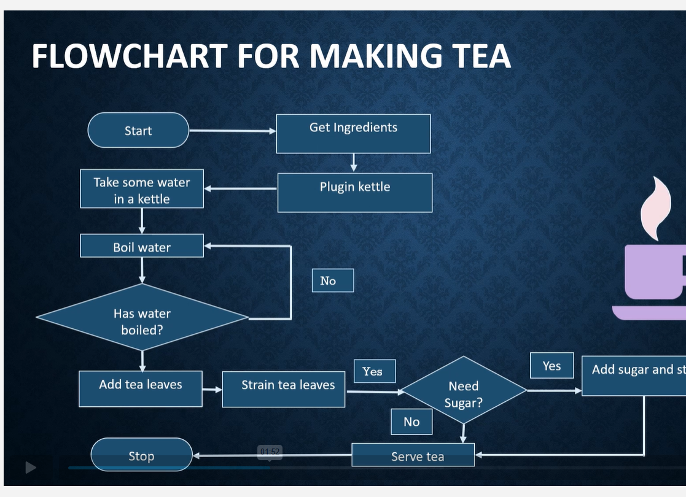

# 📘 02-Introduction to Algorithms, Flowcharts & Pseudocode

---

# 📌 Definition of Algorithm

An Algorithm is a step-by-step set of instructions used to solve a problem or complete a task.

Algorithms help us to:
- Solve problems easily
- Think logically
- Break complex tasks into smaller steps
- Find correct solutions

---

# 🎯 Importance of Algorithms

Algorithms are important because they:
- Provide clear steps to solve problems
- Improve logical thinking
- Make programming easier
- Solve real-world problems efficiently

---

# 💡 Real-Time Examples

Algorithm: Making Tea

Step 1: Start

Step 2: Get the required ingredients (water, tea leaves, sugar).

Step 3: Plug in the kettle.

Step 4: Pour water into the kettle.

Step 5: Boil the water.

Step 6: Check whether the water has boiled.

If No, continue boiling the water.
If Yes, go to Step 7.

Step 7: Add tea leaves to the boiled water.

Step 8: Strain the tea leaves.

Step 9: Check whether sugar is needed.

If Yes, add sugar and stir well.
If No, skip to Step 10.

Step 10: Serve the tea.

Step 11: Stop.

---

# 📖 Characteristics of an Algorithm

A good algorithm should:
- Have clear steps
- Follow proper sequence
- Produce correct output
- Solve problems efficiently

---

# 🧩 Problem Solving Using Algorithms

## Problem
Find the largest number in an array.

### Example Array

```text
[12, 45, 7, 89, 34]
```

---

# 📖 Algorithm

## Step 1
Start

## Step 2
Take the first number as the largest number.

```text
largest = 12
```

## Step 3
Compare the largest number with remaining numbers one by one.

- Compare 45 with 12 → 45 is larger
- Compare 7 with 45 → 45 remains larger
- Compare 89 with 45 → 89 is larger
- Compare 34 with 89 → 89 remains larger

## Step 4
Print the largest number.

```text
Largest Number = 89
```

## Step 5
Stop

---

# 📝 Pseudocode

Pseudocode is a simple way of writing program logic using normal English statements.

It helps programmers to:
- Understand logic easily
- Plan programs before coding
- Solve problems step-by-step

Pseudocode is not written in any specific programming language.

---

# 💡 Example Pseudocode

## Problem
Find the largest number in an array.

```text
START

SET largest = first element

FOR each element in array
    IF element > largest
        SET largest = element
    END IF
END FOR

PRINT largest

STOP
```

---

# ✅ Advantages of Pseudocode

- Easy to understand
- Improves logical thinking
- Helps before coding
- Reduces programming errors

---

# 📊 Flowchart
<p align="center">
  
</p>
---

# 📌 Definition of Flowchart

A Flowchart is a graphical representation of an algorithm.

It shows:
- Process flow
- Sequence of steps
- Decision making

Flowcharts make algorithms easier to understand.

---

# 💡 Importance of Flowcharts

Flowcharts help to:
- Understand process flow easily
- Visualize steps clearly
- Detect errors quickly
- Improve logical understanding

---

# 🛠️ Common Flowchart Symbols

| Symbol | Meaning |
|:---|:---|
| ⭕ Oval | Start / End |
| ▭ Rectangle | Process |
| 🔷 Diamond | Decision |
| ➡️ Arrow | Flow Direction |

---

# 💻 Importance in Programming

Algorithms, flowcharts, and pseudocode are important because:
- Programs follow step-by-step instructions
- Proper logic gives correct output
- They make coding simpler and organized
- They help programmers plan solutions before coding

---

# 🛠️ Skills Developed

- Logical Thinking
- Problem Solving
- Analytical Skills
- Decision Making
- Programming Logic

---

# 📌 Conclusion

Algorithms, flowcharts, and pseudocode help solve problems systematically and efficiently.

They are the foundation of:
- Programming
- Software Development
- Logical Thinking
- Real-world problem solving
